# Mentra.ai - System Architecture Diagram

## High-Level Architecture

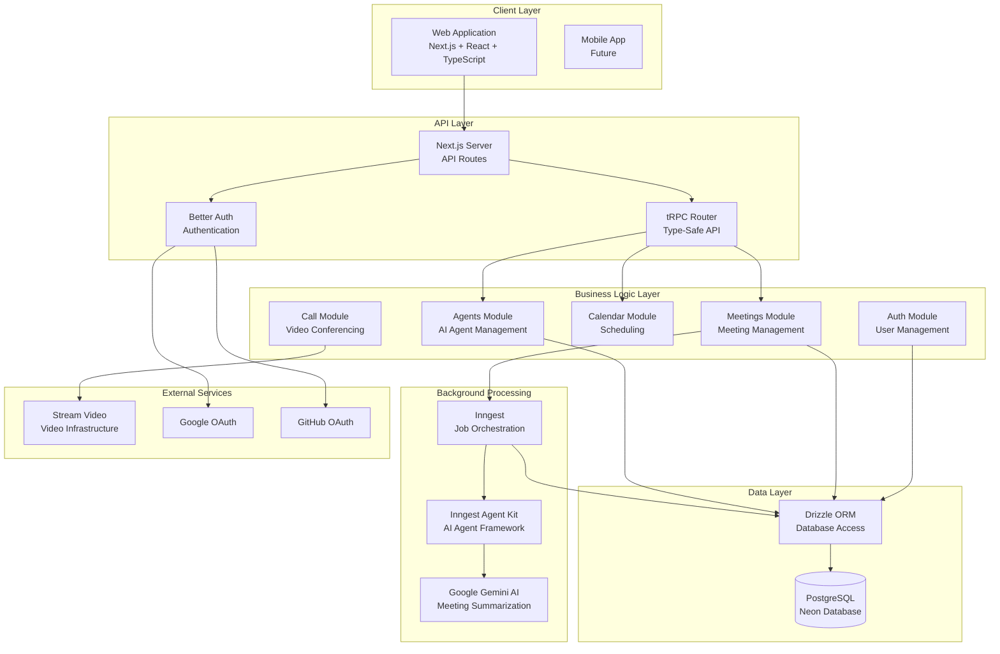

## Detailed Component Architecture

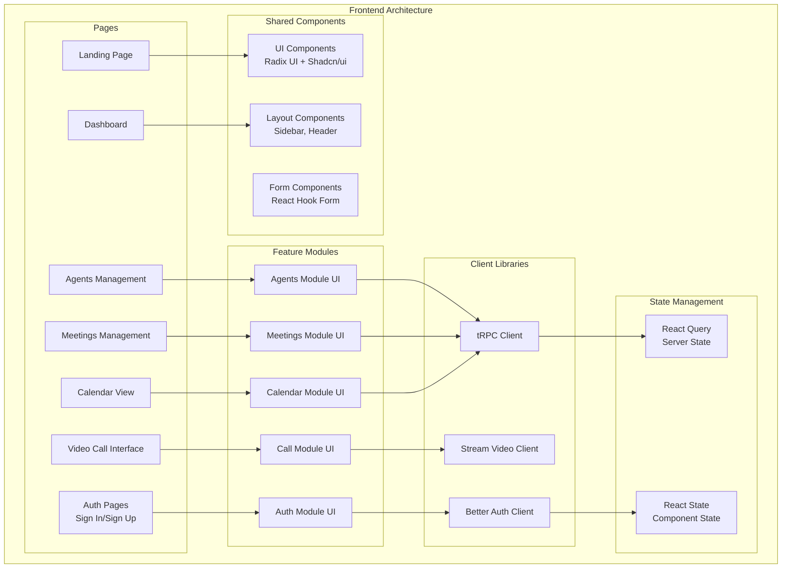

## Backend API Architecture

```mermaid
graph TB
    subgraph "API Routes"
        AuthAPI[/api/auth/[...all]<br/>Better Auth Endpoints]
        tRPCAPI[/api/trpc/[trpc]<br/>tRPC Handler]
        InngestAPI[/api/inngest<br/>Inngest Webhook]
        WebhookAPI[/api/webhook<br/>Stream Webhooks]
    end

    subgraph "tRPC Routers"
        AgentsRouter[Agents Router<br/>CRUD Operations]
        MeetingsRouter[Meetings Router<br/>CRUD + Token Generation]
    end

    subgraph "Server Procedures"
        AgentsProcedures[Agents Procedures<br/>Create, Read, Update, Delete]
        MeetingsProcedures[Meetings Procedures<br/>Create, Read, Update, Delete<br/>Token Generation, Calendar Events]
    end

    subgraph "Business Logic"
        AgentEnhancement[AI Instructions Enhancement<br/>Gemini Integration]
        MeetingToken[Stream Token Generation<br/>User Upsert]
        CalendarQuery[Calendar Event Queries<br/>Date Filtering]
    end

    AuthAPI --> BetterAuth
    tRPCAPI --> tRPCRouter
    InngestAPI --> Inngest
    WebhookAPI --> StreamVideo
    tRPCRouter --> AgentsRouter
    tRPCRouter --> MeetingsRouter
    AgentsRouter --> AgentsProcedures
    MeetingsRouter --> MeetingsProcedures
    AgentsProcedures --> AgentEnhancement
    MeetingsProcedures --> MeetingToken
    MeetingsProcedures --> CalendarQuery
```

## Database Schema Architecture

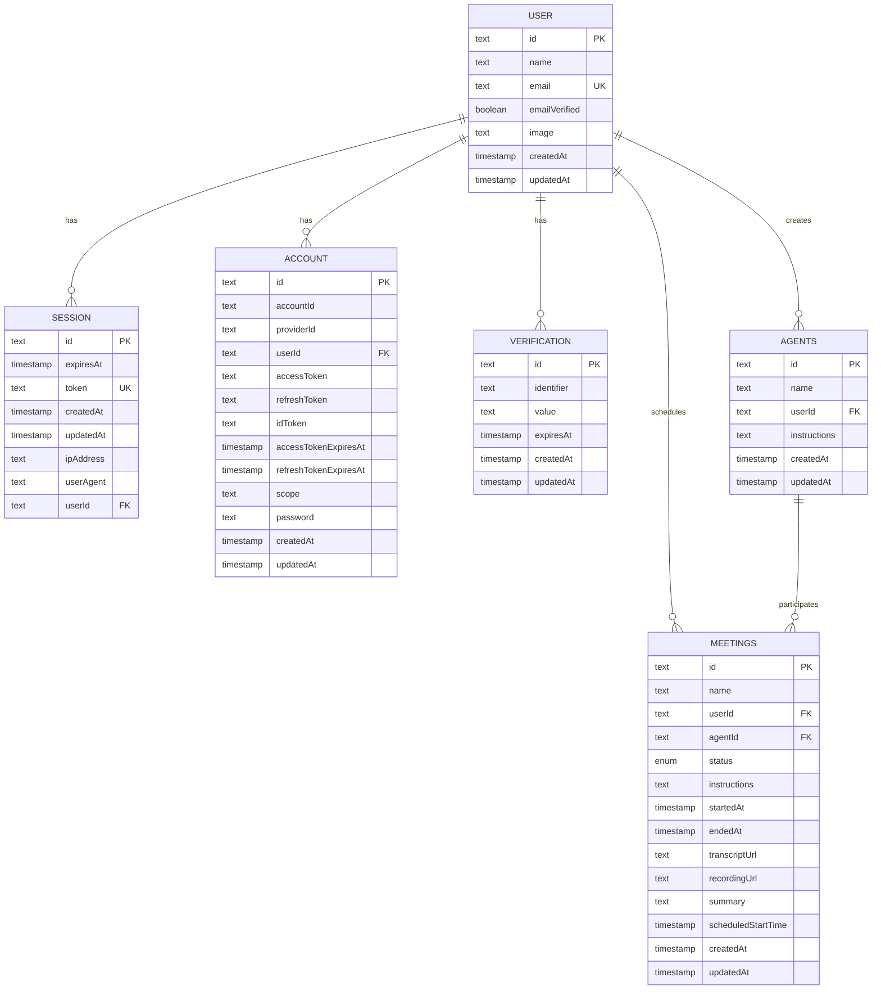

## Authentication Flow Architecture

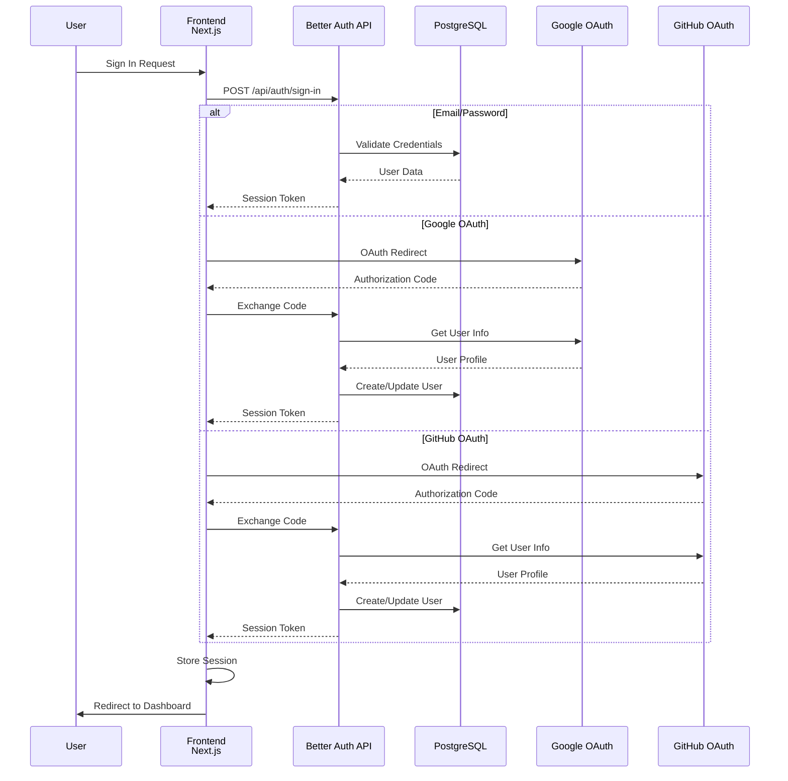

## Meeting Processing Flow Architecture

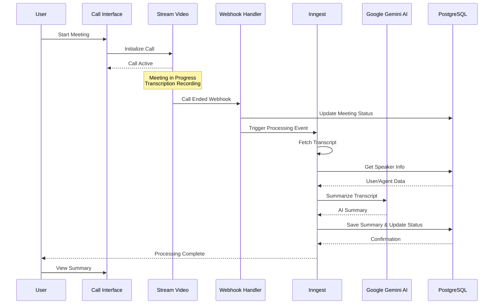

## AI Agent Enhancement Flow

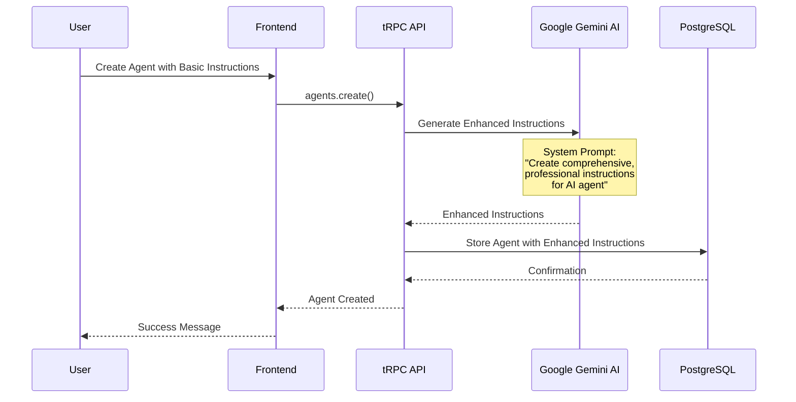

## Technology Stack Matrix

| Layer | Technology | Purpose |
|-------|-----------|---------|
| **Frontend** | Next.js 15.3.2 | React framework with App Router |
| | React 19 | UI library with concurrent features |
| | TypeScript 5 | Type-safe development |
| | Tailwind CSS 4 | Utility-first CSS framework |
| | Radix UI | Headless UI components |
| | Shadcn/ui | Component patterns |
| **Backend** | Next.js API Routes | Server-side API endpoints |
| | tRPC 11.1.2 | Type-safe API layer |
| | Drizzle ORM 0.44.4 | Database ORM |
| **Database** | PostgreSQL (Neon) | Primary database |
| **Authentication** | Better Auth 1.2.8 | Authentication library |
| | Google OAuth | Social login |
| | GitHub OAuth | Social login |
| **Video** | Stream Video SDK 1.19.7 | Video infrastructure |
| | Stream Node SDK 0.5.1 | Server-side Stream API |
| **AI/Processing** | Inngest 3.40.2 | Background job processing |
| | Inngest Agent Kit 0.9.0 | AI agent framework |
| | Google Gemini 1.15.0 | AI model for summarization |
| **State Management** | TanStack Query 5.76.1 | Server state management |
| | React Hook Form 7.62.0 | Form state management |
| **Validation** | Zod 3.25.7 | Schema validation |

## Deployment Architecture

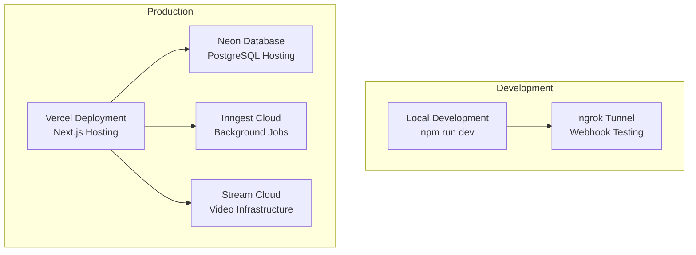

## Security Architecture

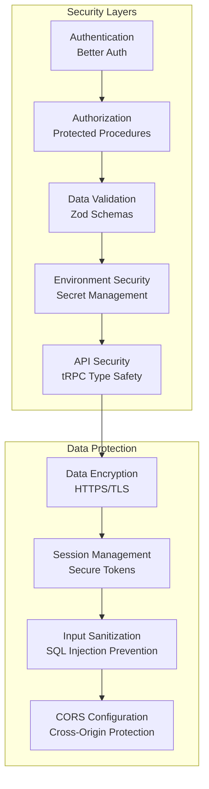

## Module Dependencies

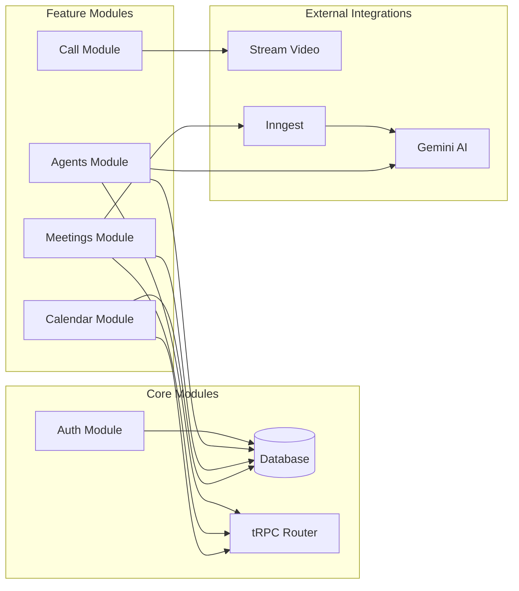

## Data Flow Architecture

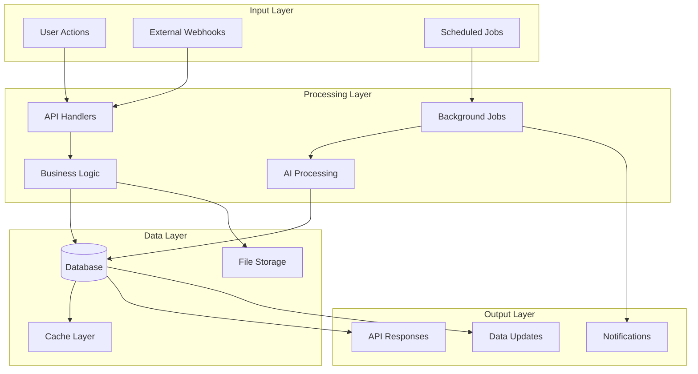

## Scalability Architecture

```mermaid
graph TB
    subgraph "Load Balancing"
        LB[Load Balancer]
    end

    subgraph "Application Servers"
        Server1[Next.js Server 1]
        Server2[Next.js Server 2]
        Server3[Next.js Server N]
    end

    subgraph "Background Workers"
        Worker1[Inngest Worker 1]
        Worker2[Inngest Worker 2]
    end

    subgraph "Data Layer"
        PrimaryDB[(Primary Database)]
        ReplicaDB[(Read Replica)]
        Cache[(Redis Cache)]
    end

    subgraph "CDN"
        CDN[Content Delivery Network]
    end

    LB --> Server1
    LB --> Server2
    LB --> Server3
    Server1 --> PrimaryDB
    Server2 --> PrimaryDB
    Server3 --> PrimaryDB
    Server1 --> ReplicaDB
    Server2 --> ReplicaDB
    Server3 --> ReplicaDB
    Server1 --> Cache
    Server2 --> Cache
    Server3 --> Cache
    Worker1 --> PrimaryDB
    Worker2 --> PrimaryDB
    Server1 --> CDN
    Server2 --> CDN
    Server3 --> CDN
```

## Monitoring & Observability

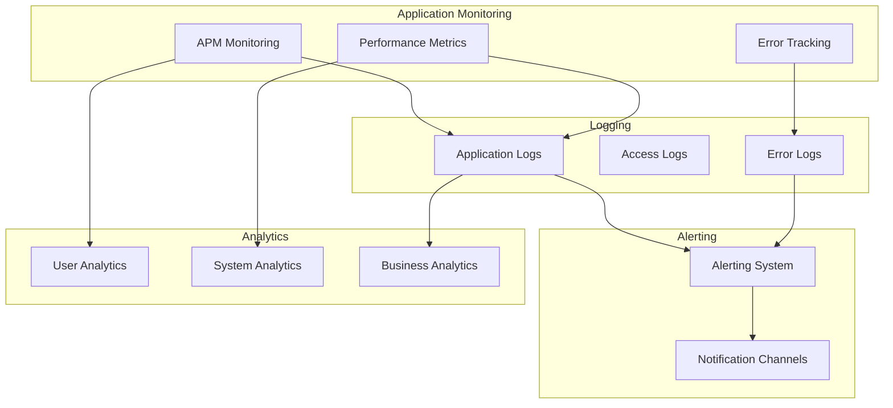

## Key Design Patterns

1. **Module-Based Architecture**: Each feature (agents, meetings, calendar) is organized as a separate module with its own UI, server logic, and hooks.

2. **Type-Safe API Layer**: tRPC provides end-to-end type safety between frontend and backend, eliminating API contract mismatches.

3. **Background Job Processing**: Inngest handles async tasks like meeting processing, ensuring the main application remains responsive.

4. **AI Enhancement**: Google Gemini AI is used to enhance user instructions for AI agents, providing more sophisticated agent behavior.

5. **Real-time Communication**: Stream Video SDK provides real-time video conferencing with built-in transcription capabilities.

6. **ORM-Based Data Access**: Drizzle ORM provides type-safe database queries with schema migrations.

7. **Component Composition**: Radix UI and Shadcn/ui provide a foundation of accessible, composable UI components.

8. **Authentication Abstraction**: Better Auth provides a unified interface for multiple authentication providers (email/password, Google, GitHub).

## Future Scalability Considerations

1. **Horizontal Scaling**: Next.js can be scaled horizontally behind a load balancer
2. **Database Scaling**: Neon supports read replicas for improved read performance
3. **CDN Integration**: Static assets can be served through CDN for better performance
4. **Microservices**: Background processing can be separated into microservices
5. **Caching Layer**: Redis can be added for caching frequently accessed data
6. **Message Queue**: Additional message queues can be added for complex workflows
7. **Multi-region Deployment**: Application can be deployed across multiple regions